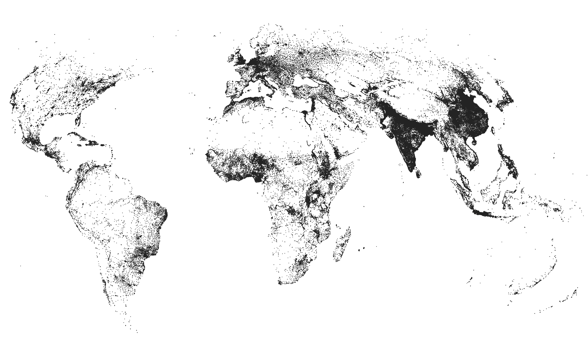

# Large cities lose their growth edge as urban systems mature

_A harmonized view of how cities grew in the United States (1850–2020) and worldwide (1975–2025), with reproducible code and shareable data._



## Paper abstract

From 1975 to 2025, urban populations have become increasingly concentrated in large cities. On average across countries, the share of urban residents living in cities with over one million people rose from 18\% in 1975 to 39\% in 2025. Will this trend towards greater concentration in large cities continue or level off? We introduce two new city population datasets that use consistent city definitions across countries and over time. The first covers the world between 1975 and 2025, using satellite imagery. The second covers the U.S. between 1850 and 2020, using census microdata. We find that urban growth follows a consistent life cycle. Early in urbanization, large cities grow faster than smaller ones. As urban systems mature, this growth advantage fades, and cities of all sizes grow at similar rates. We use this life cycle to project future concentration in large cities. Our projections suggest that over the next 50 years, concentration will increase at less than half the rate observed in the past 50 years. 

Read the paper here: https://arxiv.org/abs/2510.12417

## What’s in this project

Harmonized **boundaries** and **populations**, comparable across **time** and **countries** for:
  - **World:** 1975–2025  
  - **United States:** 1850–2020  

You can find the data [here](https://doi.org/10.5281/zenodo.17315338)

**Reproducible pipeline**
  - End‑to‑end DAG (100+ tasks) over ≈**300 GB** of raster, vector, CSV, and Parquet.
  - Outputs **200+ tables** to **PostgreSQL** (primary store) and **DuckDB** (analytics).
  - Containerized with **Docker**; orchestrated with **Dagster**.
  - Reference run (Apple M2, 32 GB RAM): **~5 hours** for the full build.

## Important links

- Paper (arXiv): https://arxiv.org/abs/2510.12417

- Raw data (Zenodo): https://doi.org/10.5281/zenodo.17343655

- Database dump (Zenodo): https://doi.org/10.5281/zenodo.17338968

- Output data (Zenodo): https://doi.org/10.5281/zenodo.17315338

## Quick start (replication)

### 0) Prerequisites
- **Docker:** https://www.docker.com/  
- **Git:** https://git-scm.com/  
- **IPUMS API key:** https://developer.ipums.org/docs/v2/get-started/

### 1) Get the code
```bash
git clone https://github.com/andreamusso96/global-city-growth.git
```
### 2) Enter the folder
```
cd global-city-growth
```

### 3) Configure environment
```
cp .env.example .env
```
Open `.env` and set the IPUMS_API_KEY=your_key_here. This is necessary to download IPUMS data (get your key [here](https://developer.ipums.org/docs/v2/get-started/))


### 4) Launch docker
```
docker compose up --build
```
First build usually takes ~3 minutes. 
This will create two docker container global-city-growth-database and global-city-growth-orchestrator. 
The first hosts a postgres database, the second hosts the code and is used to orchestrate the pipeline using Dagster. 

### 5) Orchestrate with Dagster

- Open Dagster UI: http://localhost:3000/
- Open the `Jobs` window in the top navigation bar 
- Run `0_all_job` to execute the full pipeline. The other jobs run subsets of the pipeline in case something breaks or you want to iterate
- You can monitor runs and asset materializations in the Dagster UI. [Quick guide](https://docs.dagster.io/guides/operate/webserver)

### 6) Outputs

- DuckDB and PostgreSQL are populated as configured in `.env`
- Tables and Figures are outputted in the same directory in the figures/ folder
- Inspect outputs with your favorite SQL tool or DuckDB CLI.
- Remember inputs are ≈300 GB; ensure ample free disk space for intermediates and outputs.

## How this repo is organized

The [documentation](https://andreamusso96.github.io/global-city-growth-pipeline-doc/) explaining the pipeline's tables (and their columns). 

The folder structure:

- readme/ - The readmes of the various repositories associated with the project
- src/ - The code
    - src/orchestration/ - The code for the dagster pipeline
    - src/warehouse/ - The code for the dbt parts of the pipeline
        - src/warehouse/macros - Dbt macros
        - src/warehouse/models - Dbt models

## Citation
If you use our work, please cite the [paper](https://arxiv.org/abs/2510.12417)