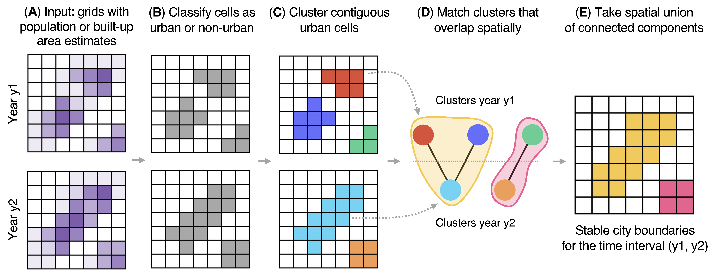

# Boundaries & population of cities: USA (1850–2020) and World (1975–2025)   

This repository provides **city boundaries** and **population** for the United States (1850-2020) and the world (1975-2025). Data are organized around the idea of **cluster_growth**: a stable city boundary computed for a time window $(y_1, y_2)$, within which growth is measured consistently. Among the numerous city definition, this definition has two main advantages: (i) it dynamically adjusts as urban areas expand; and (ii) it is consistent across space and time, facilitating robust comparative analyses.

See also the paper [PAPER LINK HERE]

## Contents

```
.
├── usa/
│ ├── usa_census_place_stable_geom.gpkg
│ ├── usa_census_place_stable_population.csv
│ ├── usa_cluster_growth_geom.gpkg
│ └── usa_cluster_growth_population.csv
└── world/
  ├── world_cluster_growth_geom.gpkg
  └── world_cluster_growth_population_country.csv 

```


---

## What is a "cluster growth"?



Cluster growth are stable city boundaries computed with the City Clustering Algorithm (CCA). The CCA computes stable city boundaries for a time interval $(y_1, y_2)$. This algorithm proceeds in five steps: (A) It takes two grids as input, one for each year, containing estimates of population or built-up area. (B) It classifies grid cell as either urban or non-urban using a threshold on these population/built-up area estimates. (C) It groups contiguous urban grid cells to form clusters. (D) It matches clusters across years when they overlap spatially, forming a bipartite graph. (E) It defines a city's boundary as the spatial union of all clusters within a single connected component of the graph. See the paper for full details.

An important choice in the algorithm above are the population and built-up area thresholds to classify a cell as urban or non-urban. We provide the following thresholds in the datasets below:
- **USA:** people‑per‑pixel thresholds (**50**, **100**, **200**).  
- **World:** GHSL SMOD degree‑of‑urbanization (**exclusive thresholds**; e.g., 21 ⇒ use cells with value **> 21**). Values used: **21 (Suburban+), 22 (Semi‑dense+), 23 (Dense urban+).**

**Core references (methods):**
1. [PAPER LINK HERE]
2. Rozenfeld, H.D., Rybski, D., Gabaix, X., & Makse, H.A. (2008). *The City Clustering Algorithm.* (add complete citation/DOI)

---

## Sources

**USA (1850–2020)**  
- IPUMS Full Count (1850–1940): https://usa.ipums.org/usa/full_count.shtml  
- NHGIS Place points & population time series (1990–2020):  
  - Time series: https://www.nhgis.org/time-series-tables  
  - Place identifiers: https://www.nhgis.org/place-points#identifiers

**Global (1975–2025)**  
- GHSL SMOD 2023 (degree of urbanization): https://human-settlement.emergency.copernicus.eu/ghs_smod2023.php  
- GHSL POP (population rasters): https://human-settlement.emergency.copernicus.eu/ghs_pop.php  
- CShapes (country boundaries). *Add version and official URL you used.*

---

## File and column documentation

### `usa/usa_census_place_stable_geom.gpkg`
**What:** Point locations for **stable census places** (subset of NHGIS places) with cleaned/harmonized population histories.

- `census_place_id` — NHGISPLACE code (see NHGIS identifiers link above).
- `geom` - CRS **EPSG:5070** (Conus Albers).

**What are stable census places?**  
We unify historical (1850–1940) “historical census places” and modern (1990–2020) NHGIS places, resolve disappearing places and implausible spikes using migration‑informed linkages (via IPUMS linking). Result: a harmonized, cleaner place‑level panel for long‑run analysis (full pipeline in the paper).

---

### `usa/usa_census_place_stable_population.csv`
**What:** Population time series for **stable census places** (1850–2020; missing years: **1890, 1950, 1960, 1970, 1980**).

- `census_place_id` — NHGISPLACE code.  
- `year` — observation year.  
- `population` — total persons.

**Provenance:**  
Historical (1850–1940) counts reconstructed from IPUMS Full Count + Census Place Project mapping; modern (1990–2020) from NHGIS time series. 

---

### `usa/usa_cluster_growth_geom.gpkg`
**What:** Stable **cluster_growth** geometries for USA.

  - `cluster_id` — deterministic ID = concat of `y1`, `y2`, `urban_threshold` (people‑per‑pixel), and an **integer index** obtained by sorting cluster centroids west→east, then north→south.  
  - `y1` — start year.  
  - `y2` — end year.  
  - `urban_threshold` — people‑per‑pixel threshold to be classified as urban (**50**, **100**, **200**).
  - `geom` - CRS **EPSG:5070**.

**Method:** See *What is a "cluster growth"* above and the paper.

---

### `usa/usa_cluster_growth_population.csv`
**What:** Population of each USA **cluster_growth** at $y_1$ and $y_2$ (also includes rows where $y_1$ = $y_2$ for single‑year snapshots).

- `cluster_id` — matches geometry file.  
- `y1` — start year.  
- `y2` — end year.  
- `urban_threshold` — matches geometry file.  
- `population_y1` — persons within the **stable** boundary measured at $y_1$.  
- `population_y2` — persons within the **stable** boundary measured at $y_2$.

**Computation:** Sum the populations of all **census places** that fall inside the stable cluster boundary at the corresponding year. Growth can be computed as $\text{population\_y2} / \text{population\_y1}$ (or log‑difference).

---

### `world/world_cluster_growth_geom.gpkg`
**What:** Stable **cluster_growth** geometries for the world derived from **GHSL SMOD**.

  - `cluster_id` — deterministic ID = concat of `y1`, `y2`, `urban_threshold`, and an **integer index** (centroid sort west→east, then north→south).  
  - `y1` — start year.  
  - `y2` — end year.  
  - `urban_threshold` — SMOD degree‑of‑urbanization threshold (**exclusive**; 21, 22, 23 as above).
  - `geom` - CRS **EPSG:54009** (Mollweide).

**Method:** See *What is a "cluster growth"* above and the paper. The degree of urbanization threshold comes from GHSL SMOD (see link above).

---

### `world/world_cluster_growth_population_country.csv`
**What:** Population of each global **cluster_growth** at \(y_1\) and \(y_2\).

- `cluster_id` — matches geometry file.  
- `y1` — start year.  
- `y2` — end year.  
- `urban_threshold` — matches geometry file.  
- `population_y1` — persons from **GHSL POP** cells intersecting the stable boundary at $y_1$.  
- `population_y2` — persons from **GHSL POP** cells intersecting the stable boundary at $y_2$.  
- `country` - World Bank code of the country in which the cluster is located. Country boundaries are 2019 boundaries according to the Cshapes database. 

---

## Coordinate Reference Systems (CRS)

- **USA:** EPSG:5070 (NAD83 / Conus Albers). Units: meters.  
- **World:** EPSG:54009 (Mollweide). Units: meters.  
- Files are **GPKG** carrying coordinates in these CRSs.

---

## Quick start (GeoPandas)

```python
import pandas as pd, geopandas as gpd

# USA clusters (geometry)
g = gpd.read_file("usa/usa_cluster_growth_geom.gpkg")

if g.crs is None or (g.crs.to_epsg() or 0) != 5070:
    g = g.set_crs(5070, allow_override=True)

# Join population
p = pd.read_csv("usa/usa_cluster_growth_population.csv")
gpop = g.merge(p, on=["cluster_id","y1","y2","urban_threshold"], how="left")

# Example: compute growth ratio
gpop["growth_ratio"] = gpop["population_y2"] / gpop["population_y1"]

```

